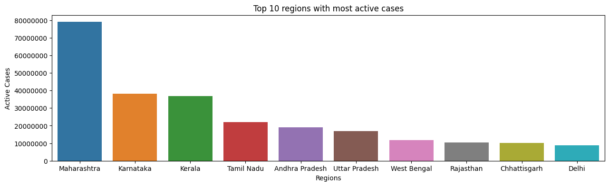
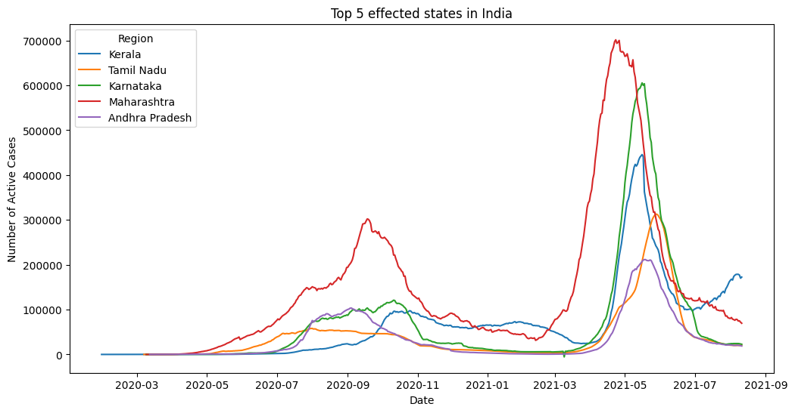
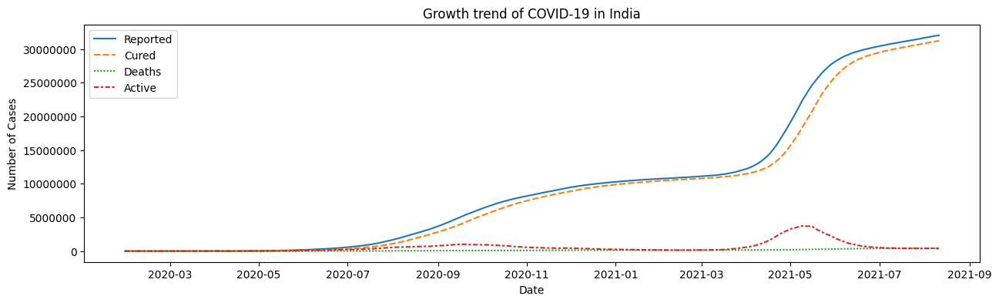

# COVID-19 Data Analysis Project

COVID-19 Data Analysis Project for the year 2021. It utilizes Python libraries such as NumPy, Pandas, Matplotlib, and Seaborn to perform various data analysis tasks and visualize the data.

## Project Structure

The data directory contains the CSV files which store the COVID-19 data for the year 2021.
The requirements.txt file lists the Python libraries and their versions required to run the project.
The analysis.py file contains the Python script that performs the data analysis tasks and generates the visualizations.

## Getting Started
To get started with the project, follow these steps:

1. Clone the repository or download the project files.

2. Ensure that you have Python installed on your system.

3. Install the required libraries by running the following command:
```
pip install -r requirements.txt
```

## Project Details
The analysis.py script performs the following data analysis tasks and generates the corresponding visualizations:

1. Top 10 Regions with Most Active Cases: Displays a bar chart showing the top 10 regions with the most active COVID-19 cases.


2. Growth Trend to Display the Growth of COVID-19: Plots a line chart to visualize the growth trend of COVID-19 cases over time.


3. Growth Trend to Display Top 5 Affected States: Shows a line chart representing the growth trend of COVID-19 cases in the top 5 affected states.


4. Gender Distribution of Vaccinated Individuals: Displays a pie chart representing the distribution of vaccinated individuals by gender.


5. Most Vaccinated Regions: Presents a bar chart displaying the most vaccinated regions based on the available data.

